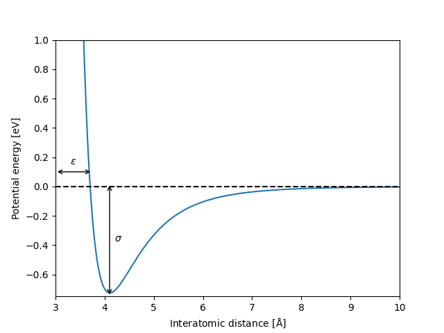

Introduction to the FitLJ package
=================================

Interatomic potentials based on analytical, physically-motivated functions are fundamental ingredients in molecular simulations.
Using them as surrogate models of more elaborate *ab-initio* methods can speed-up simulations by a factor up to :math:`10^4`.

The accuracy of interatomic potential models heavily relies on their parameters. Well parametrized models can match the accuracy 
of *ab-initio* methods, whereas poorly parametrized models can result in highly unphysical results. A key aspect in the application 
of any interatomic potential model lies therefore an accurate parametrization strategy. 

The FitLJ package allows one to fit interatomic potential models based on the well-established Lennard-Jones potential, using a 
reference data set obtained from calculations performed with more accurate and computationally expensive *ab-initio* methods. 
The reference FitLJ program leverage on the database functionalities of the Atomic Simulation Environment (`ASE <https://wiki.fysik.dtu.dk/ase/>`_) package. Any *ab-initio* software that can be coupled to ASE can therefore be used to produce the reference dataset to be used within FitLJ. 

The functional form of the Lennard-Jones potential is

.. math::
   :label: lj_equation

   V_\mathrm{LJ} = 4 \epsilon \Big[ \Big(\frac{\sigma}{r}\Big)^{12} - \Big(\frac{\sigma}{r}\Big)^6 \Big],

where the parameters :math:\espilon and :math:\sigma determine the depth of the potential well and the equilibrium distance, as shown Figure :numref:`lj_figure`:

.. _lj_figure:

   Lennard-Jones potential for :math:`\epsilon = 3.3` and :math:`\sigma = 1.0`. The vertical and horizontal lines indicate the potential defined by the parameters :math:`\epsilon` and :math:`\sigma`, respectively.

FitLJ takes as input the energies of a discrete set of atomic configuration stored in an ASE database, and fit the functional form of Eq. :eq:`lj_equation`. The program then produces as output the values of :math:`\epsilon` and :math:`\sigma` that provide the best match to the data. 